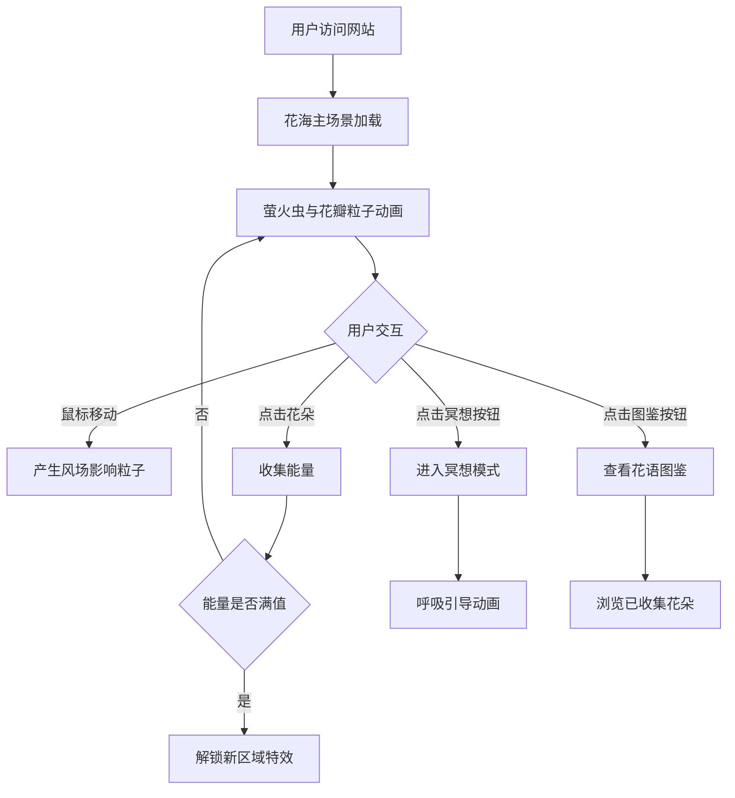

## 1. 产品概述

一款沉浸式花海互动体验网站，以用户提供的电影级花海图片为核心视觉背景，融合自然治愈美学与创意Web交互技术。用户通过鼠标/触摸与花海中的萤火虫、花瓣、风等元素互动，在宁静唯美的氛围中收集花朵、解开自然谜题，获得放松与治愈的游戏化体验。

目标用户：寻求放松、喜欢自然美学、享受轻量级互动体验的用户
核心价值：将静态美景转化为可互动的沉浸式治愈体验

## 2. 核心功能

### 2.1 功能模块
1. **首页（花海主场景）**：全屏花海背景、动态萤火虫群、飘落花瓣粒子、风力交互系统
2. **花朵收集系统**：点击/悬停花朵收集能量，解锁新区域和特效
3. **风之互动**：鼠标移动产生风场，影响花瓣和萤火虫的飘动轨迹
4. **冥想模式**：定时呼吸引导，配合视觉节奏，帮助用户放松
5. **花语图鉴**：收集到的花朵展示，附带花语和治愈文案

### 2.2 页面详情
| 页面名称 | 模块名称 | 功能描述 |
|---------|---------|---------|
| 首页 | 花海主场景 | 全屏花海背景图+Canvas粒子系统（萤火虫+花瓣）+风力场交互 |
| 首页 | 能量收集 | 鼠标悬停花朵产生光晕，点击收集能量，能量条显示在角落 |
| 首页 | 风之互动 | 鼠标移动产生风场向量，影响粒子运动轨迹，产生拖尾效果 |
| 冥想模式 | 呼吸引导 | 全屏半透明遮罩，圆形缩放动画引导呼吸，背景音乐切换 |
| 花语图鉴 | 收集展示 | 网格展示已收集花朵，点击展开花语卡片和治愈文案 |
| 设置面板 | 音效控制 | 开关环境音效、调整粒子密度、切换日夜模式 |

## 3. 核心流程

用户进入网站 → 被花海背景和萤火虫吸引 → 移动鼠标产生风场与粒子互动 → 点击花朵收集能量 → 能量满后解锁新区域特效 → 进入冥想模式放松 → 查看花语图鉴了解收集成果 → 调整设置个性化体验。

## 4. 用户界面设计

### 4.1 设计风格
- **主色调**：以花海图片的紫粉色系为灵感，深紫 `#2d1b4e`、粉紫 `#b76eb8`、暖粉 `#e8a0bf`、淡金 `#f0d878`
- **辅助色**：夜空蓝 `#1a1a3e`、萤火虫绿 `#a8e6cf`、花瓣白 `#fff5f5`
- **按钮风格**：玻璃拟态（Glassmorphism）圆角按钮，悬浮时发光扩散
- **字体**：标题使用 `Cormorant Garamond`（优雅衬线体），正文使用 `Noto Sans SC`
- **布局风格**：全屏沉浸式，无传统导航栏，仅角落悬浮功能按钮
- **特效风格**：粒子系统、光晕扩散、风场拖尾、玻璃拟态UI

### 4.2 页面设计概述
| 页面名称 | 模块名称 | UI元素 |
|---------|---------|--------|
| 首页 | 花海背景 | 全屏固定背景图，暗角 vignette 效果，营造电影感 |
| 首页 | 粒子系统 | Canvas层叠在背景上，萤火虫（发光圆点+拖尾）、花瓣（半透明图片/形状） |
| 首页 | 能量UI | 右上角玻璃拟态面板，能量条+已收集花朵数量 |
| 首页 | 功能按钮 | 左下角悬浮按钮组：冥想、图鉴、设置，圆形玻璃拟态图标按钮 |
| 首页 | 风场反馈 | 鼠标移动时产生半透明波纹扩散，粒子被风吹散 |
| 冥想模式 | 呼吸引导 | 中央半透明圆环，缩放动画（4秒吸气-4秒呼气），全屏暗化 |
| 花语图鉴 | 卡片网格 | 玻璃拟态卡片，花朵图标+名称+收集进度，点击翻转显示花语 |
| 设置面板 | 滑块开关 | 玻璃拟态面板，音效开关、粒子密度滑块、日夜模式切换 |

### 4.3 响应式设计
- **桌面端**（>1024px）：完整粒子数量，鼠标风场交互，悬浮提示
- **平板端**（768-1024px）：减少粒子数量30%，保持核心交互
- **移动端**（<768px）：触摸产生风场，简化UI，底部固定按钮栏

### 4.4 动画与交互
- **页面加载**：背景淡入，粒子从无到有渐显，萤火虫随机闪烁
- **鼠标交互**：移动产生风场向量，粒子轨迹偏移，鼠标周围产生光晕
- **点击花朵**：花朵发光扩散，能量条增长，花瓣爆裂特效
- **能量满值**：全屏金色光波扩散，新区域粒子颜色变化
- **冥想模式**：圆环呼吸动画，背景缓慢缩放，营造沉浸感
