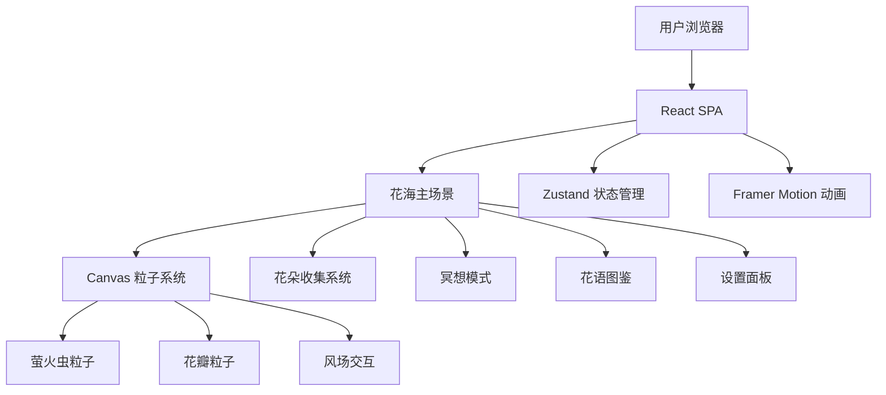

## 1. 架构设计



## 2. 技术描述

- **前端**：React@18 + TypeScript + TailwindCSS@3 + Vite
- **初始化工具**：vite-init
- **路由**：单页应用，状态切换（无路由库，使用条件渲染）
- **动画**：Framer Motion（UI动画）+ Canvas API（粒子系统）
- **状态管理**：Zustand（游戏状态、收集进度、设置）
- **图标**：Lucide React
- **字体**：Cormorant Garamond + Noto Sans SC（Google Fonts）
- **无后端**：纯前端项目，使用静态数据和 localStorage 存储进度

## 3. 路由定义

| 路由 | 用途 |
|------|------|
| / | 单页应用，花海主场景 |
| 状态切换 | 冥想模式、花语图鉴、设置面板通过状态管理切换显示 |

## 4. 组件架构

### 4.1 全局组件
- `FlowerField`：花海主场景容器，管理背景图和Canvas层
- `ParticleCanvas`：Canvas粒子系统（萤火虫+花瓣+风场）
- `GlassButton`：玻璃拟态按钮组件
- `GlassPanel`：玻璃拟态面板容器

### 4.2 页面/模块组件
- `HeroScene`：花海主场景，包含粒子系统和交互
- `MeditationMode`：冥想模式呼吸引导
- `FlowerCollection`：花语图鉴展示
- `SettingsPanel`：设置面板
- `EnergyBar`：能量条UI

### 4.3 自定义 Hooks
- `useParticleSystem`：管理Canvas粒子系统生命周期
- `useWindField`：计算鼠标风场对粒子的影响
- `useGameState`：游戏状态管理（能量、收集进度）

## 5. 数据模型

### 5.1 花朵数据
```typescript
interface Flower {
  id: string;
  name: string;
  color: string;
  meaning: string;
  healingText: string;
  position: { x: number; y: number };
  collected: boolean;
  energyValue: number;
}
```

### 5.2 游戏状态
```typescript
interface GameState {
  energy: number;
  maxEnergy: number;
  collectedFlowers: string[];
  unlockedEffects: string[];
  settings: {
    particleDensity: number;
    soundEnabled: boolean;
    dayNightMode: 'day' | 'night';
  };
}
```

### 5.3 粒子数据
```typescript
interface Particle {
  x: number;
  y: number;
  vx: number;
  vy: number;
  size: number;
  opacity: number;
  type: 'firefly' | 'petal';
  color: string;
}
```

## 6. 样式系统

### 6.1 CSS 变量
```css
:root {
  --color-deep-purple: #2d1b4e;
  --color-pink-purple: #b76eb8;
  --color-warm-pink: #e8a0bf;
  --color-pale-gold: #f0d878;
  --color-night-blue: #1a1a3e;
  --color-firefly: #a8e6cf;
  --color-petal: #fff5f5;
  --glass-bg: rgba(255, 255, 255, 0.1);
  --glass-border: rgba(255, 255, 255, 0.2);
  --font-display: 'Cormorant Garamond', serif;
  --font-body: 'Noto Sans SC', sans-serif;
}
```

### 6.2 Tailwind 配置扩展
- 自定义颜色（花海紫粉系）
- 自定义字体
- 自定义动画（呼吸、光晕扩散、风场波纹）
- 玻璃拟态工具类
